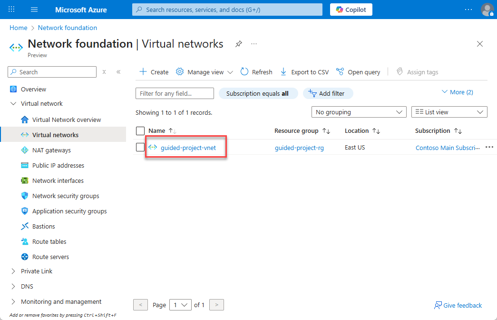
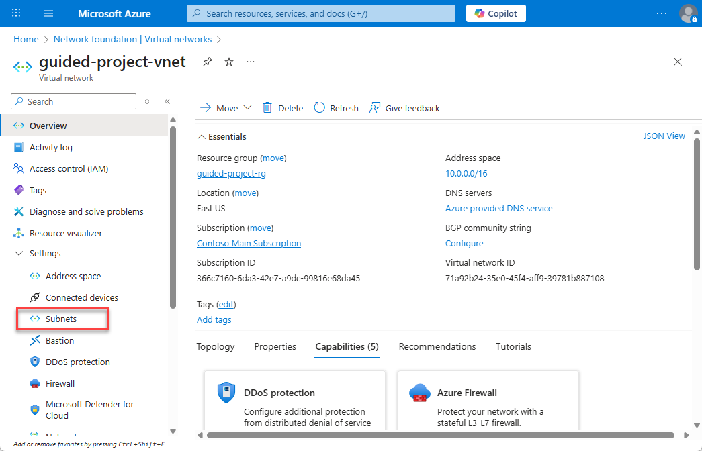
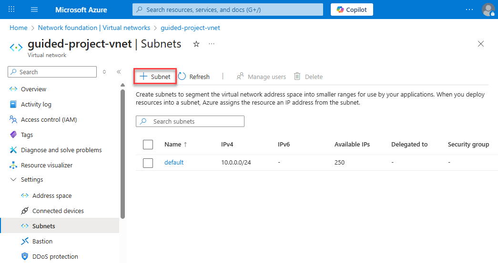
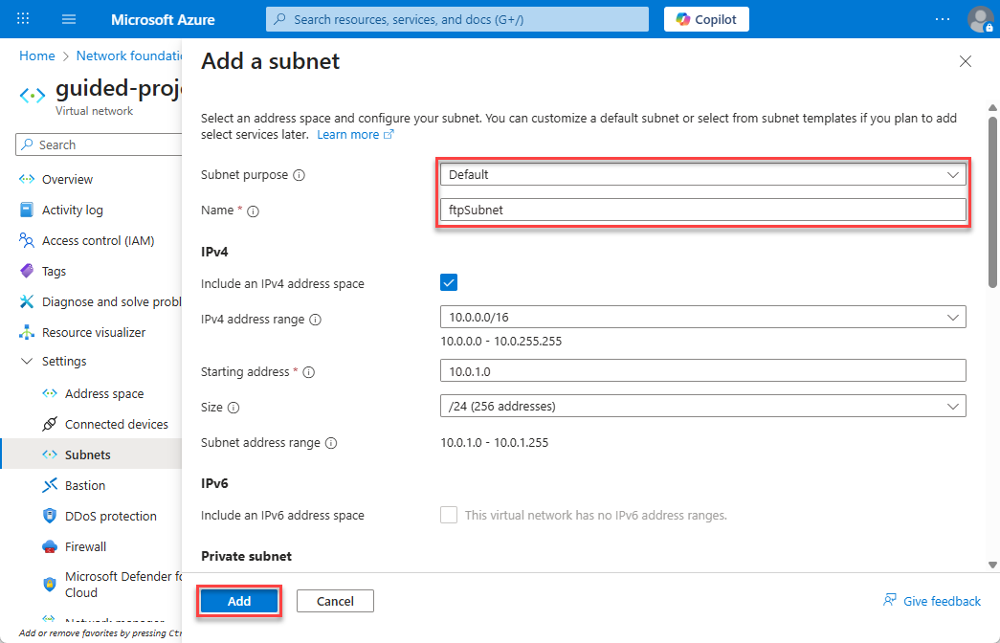
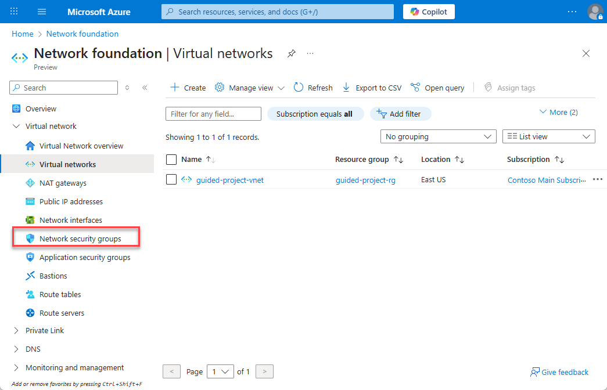
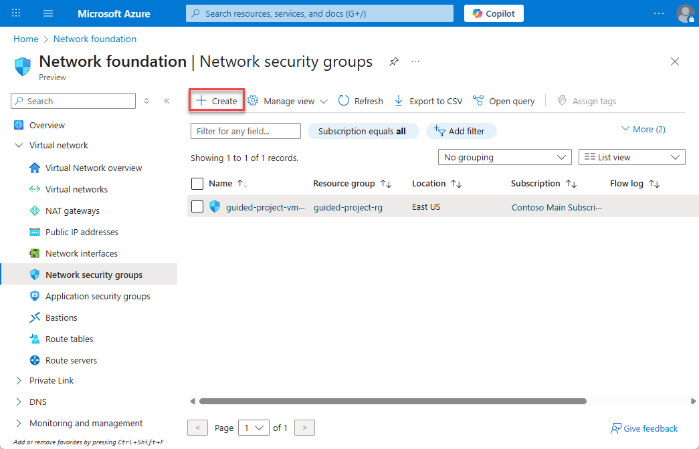
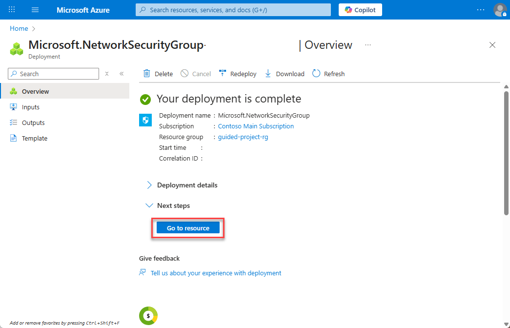
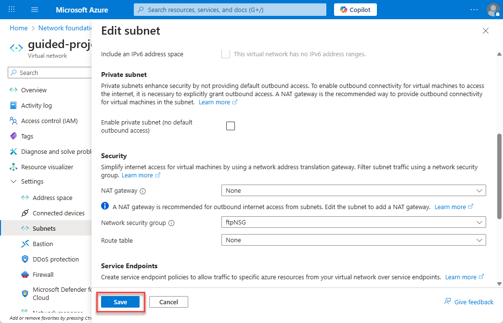

---
lab:
    title: 'Exercise – Update the virtual network'
---

# Exercise – Update the virtual network

> **Note:** Ensure you complete the **Prepare** exercise before stating this exercise. If you haven’t completed the **Prepare** exercise, the resources needed for this exercise will not be available.

## Scenario
You’re helping an Azure Admin maintain resources. While you won’t be responsible for maintaining the entire infrastructure, the Admin will ask you to help out by completing certain tasks.
Currently, there’s a Linux virtual machine (VM) that’s underutilized, and a need for a new Linux machine to serve as an FTP server. However, the Azure admin wants to be able to track network flow and resource utilization for the needed FTP server, so has asked you to start out by provisioning a new subnet.
The current subnet should be left alone, as there are future plans for using it for additional VMs.

## Create a new subnet on an existing virtual network (vNet)
1.	Login to Microsoft Azure at [https://portal.azure.com](https://portal.azure.com)
2.	From the Azure portal home page, in the search box, enter **virtual networks**.
3.	Select **virtual networks** under services.
4.	Select the *guided-project-vnet* virtual network.

5.	From the *guided-project-vnet* blade, under settings, select Subnets.

6.	To add a subnet, select **+ Subnet**.

7.	For **Subnet purpose** leave it as **Default**.
8.	For **Name** enter: `ftpSubnet`.
9.	Leave the rest of the settings alone and select **Add**.

10.	Select **Home** to return to the Azure portal home page.

Congratulations – you’ve completed the creation of a subnet. This subnet is only going to be used for SFTP traffic. To increase security, you need to configure a **Network security group** to restrict which ports are allowed on the subnet.

## Create a network security group
1.	From the Azure portal home page, in the search box, enter **virtual networks**.
2.	Select **virtual networks** under services.
3.	Select **Network security groups**.

4.	Select **+ Create**.

5.	Verify the subscription is correct.
6.	Select the *guided-project-rg* resource group.
7.	Enter `ftpNSG` for the network security group name.
8.	Select **Review + create**.

9.	Once the validation is complete, select **Create**.
10.	Wait for the screen to refresh and display **Your deployment is complete**.
11.	Select **Home** to return to the Azure portal home page.
12.	Select **Go to resource**.
13.	

### Create an inbound security rule
1.	Under settings, select **Inbound security rules**.
2.	Select **+ Add**.
3.	Change the **Destination port ranges** from 8080 to `22`.
4.	Select **TCP** for the protocol.
5.	Set the name to `ftpInbound`.
6.	Select **Add**.
7.	Select **Home** to return to the Azure portal home page.

Congratulations – you’ve created a new Network security group and configured rules to allow inbound FTP traffic. Now, you’ll need to associate the new network security group with the **ftpSubnet**.

## Associate a network security group to a subnet
1.	From the Azure portal home page, in the search box, enter **virtual networks**.
2.	Select **virtual networks** under services.
3.	Select the **guided-project-vnet** virtual network.
4.	Under settings, select **Subnets**.
5.	Select the **ftpSubnet** you created.
6.	On the Edit subnet page, under the Security section heading, update the Network security group field to **ftpNSG**.
7.	Select **Save**.

Nicely done. It looks like you’ve completed the work needed to prepare the network for shifting the current Linux VM to a new subnet that’s designed to handle incoming FTP traffic.
